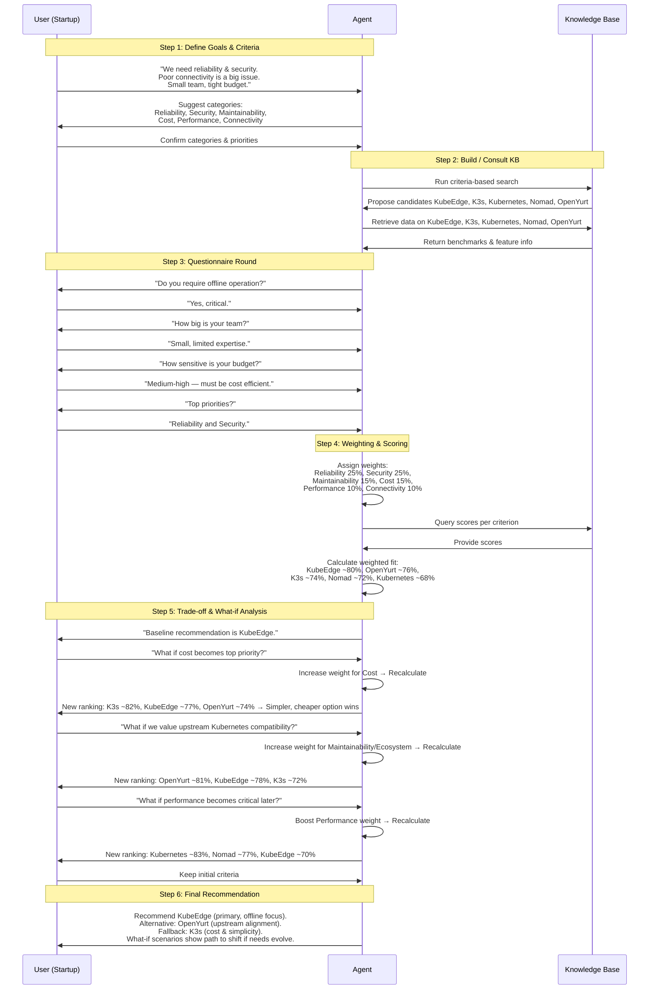

# Scenario 1 diagram

```mermaid
sequenceDiagram
    participant U as User (Startup)
    participant F as Agent
    participant KB as Knowledge Base

    Note over U,F: Step 1: Define Goals & Criteria
    U->>F: "We need reliability & security.<br/> Poor connectivity is a big issue.<br/> Small team, tight budget."
    F->>U: Suggest categories:<br/>Reliability, Security, Maintainability,<br/>Cost, Performance, Connectivity
    U->>F: Confirm categories & priorities

    Note over F,KB: Step 2: Build / Consult KB
    F->>KB: Run criteria-based search
    KB->>F: Propose candidates KubeEdge, K3s, Kubernetes, Nomad, OpenYurt
    F->>KB: Retrieve data on KubeEdge, K3s, Kubernetes, Nomad, OpenYurt
    KB->>F: Return benchmarks & feature info

    Note over U,F: Step 3: Questionnaire Round
    F->>U: "Do you require offline operation?"
    U->>F: "Yes, critical."
    F->>U: "How big is your team?"
    U->>F: "Small, limited expertise."
    F->>U: "How sensitive is your budget?"
    U->>F: "Medium-high — must be cost efficient."
    F->>U: "Top priorities?"
    U->>F: "Reliability and Security."

    Note over F: Step 4: Weighting & Scoring
    F->>F: Assign weights:<br/>Reliability 25%, Security 25%,<br/>Maintainability 15%, Cost 15%,<br/>Performance 10%, Connectivity 10%
    F->>KB: Query scores per criterion
    KB->>F: Provide scores
    F->>F: Calculate weighted fit:<br/>KubeEdge ~80%, OpenYurt ~76%,<br/>K3s ~74%, Nomad ~72%, Kubernetes ~68%

    Note over F,U: Step 5: Trade-off & What-if Analysis
    F->>U: "Baseline recommendation is KubeEdge."
    U->>F: "What if cost becomes top priority?"
    F->>F: Increase weight for Cost → Recalculate
    F->>U: New ranking: K3s ~82%, KubeEdge ~77%, OpenYurt ~74% → Simpler, cheaper option wins
    U->>F: "What if we value upstream Kubernetes compatibility?"
    F->>F: Increase weight for Maintainability/Ecosystem → Recalculate
    F->>U: New ranking: OpenYurt ~81%, KubeEdge ~78%, K3s ~72%
    U->>F: "What if performance becomes critical later?"
    F->>F: Boost Performance weight → Recalculate
    F->>U: New ranking: Kubernetes ~83%, Nomad ~77%, KubeEdge ~70%
    U->>F: Keep initial criteria

    Note over F,U: Step 6: Final Recommendation
    F->>U: Recommend KubeEdge (primary, offline focus).<br/>Alternative: OpenYurt (upstream alignment).<br/>Fallback: K3s (cost & simplicity).<br/>What-if scenarios show path to shift if needs evolve.
```